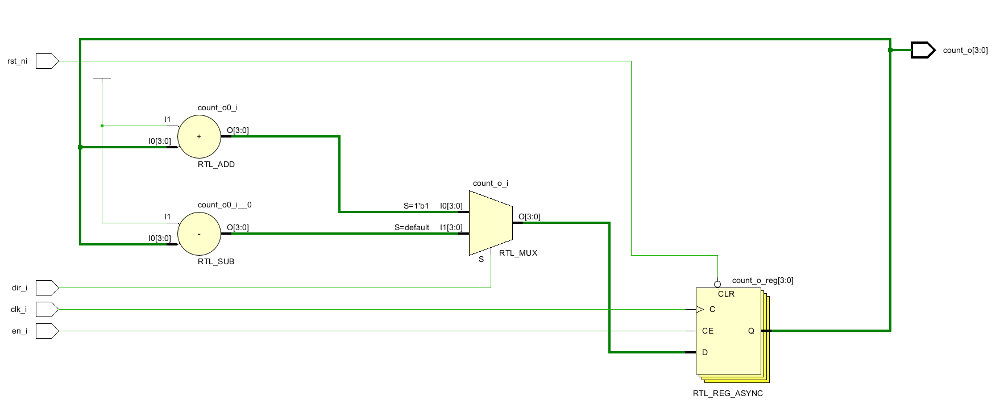

# Counter Module (SystemVerilog)

This repository contains a parameterized **up/down counter** written in **SystemVerilog**, along with a self-checking-style **testbench**.  
The design uses clean RTL practices such as packages, enums, enable control, and an asynchronous active-low reset.

---

## counter_pkg.sv

The package file centralizes shared parameters and type definitions.

```sv
package counter_pkg;
    parameter int WIDTH = 4;
    typedef enum logic {DOWN=1'b0, UP=1'b1} count_dir_e;
endpackage
```

---

## Contents

- **WIDTH**

Defines the bit-width of the counter output

- **count_dir_e**

Enum for counter direction:
    - `UP`: increment
    - `DOWN`: decrement

---

## Signal Description

| Signal  | Direction | Description                   |
|---------|-----------|-------------------------------|
| clk_i   | Input     | Clock signal                  |
| rst_ni  | Input     | Asynchronous active-low reset |
| en_i    | Input     | Enable signal                 |
| dir_i   | Input     | Count direction(`UP`/`DOWN`)  |
| count_o | Output    | Counter output                |

---

## Functional Behaviour

- Reset (`reset_ni = 0`)
    - Counter is cleared to zero.
- On each rising clock edge
    - If `en_i = 1`:
        - `dir_i == UP` -> counter increments
        - `dir_i == DOWN` -> counter decrements
    - If `en_i = 0`:
        - Counter holds its current value.
- Counter wraps around naturally (modulo arithmetic).

---

## Schematic

<p align="center">
  
</p>

<p align="center">
  <em>Figure 1: Post-synthesis schematic of the parametric counter</em>
</p>

---

## Timing Analysis Results

Post-synthesis timing analysis was performed on the design with the clock frequency of 100MHz.  
The following key timing metrics were obtained:

| Metric | Value | Description |
|------|-------|-------------|
| **WNS** | **8.861 ns** | Worst Negative Slack. Positive value indicates that all setup timing constraints are met with significant margin. |
| **WHS** | **0.066 ns** | Worst Hold Slack. Positive value indicates no hold time violations. |
| **TNS** | **0.000 ns** | Total Negative Slack. Zero value confirms there are no failing timing paths in the design. |

### Interpretation

- **Setup Timing**:  
  A WNS of **8.861 ns** shows the design comfortably meets setup requirements, leaving ample timing margin for higher clock frequencies or additional logic.

- **Hold Timing**:  
  A WHS of **0.066 ns** indicates hold constraints are met. While the margin is smaller compared to setup slack, it is still positive and therefore safe.

- **Overall Timing Closure**:  
  The **TNS = 0.000 ns** confirms that there are no timing violations across the entire design.

### Conclusion

The counter design achieves **full timing closure** under the analyzed constraints and is suitable for synthesis and deployment without timing-related issues.

---

