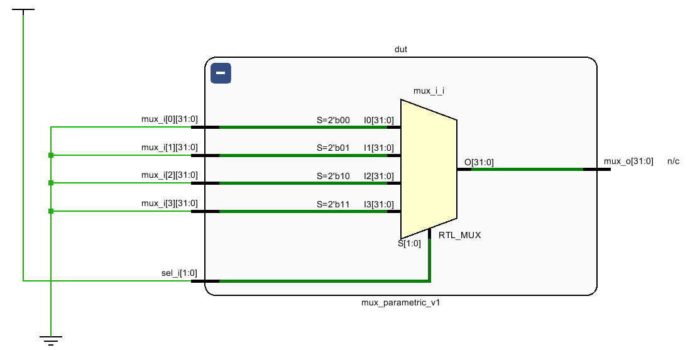

# Parametric MUX (SystemVerilog)

This project contains two different RTL coding styles (v1: 'always_comb', v2: 'assign') for a **Parametric Multiplexer** design and focuses on comparing **synthesis + implementation + timing/area** on **Vivado**.

> Note: There two versions are functionally identical, and in most cases, Vivado synthesis reduces both to the **same netlist**. This project aims to **verify this situation through reports**.

---

## Contents

- [Design Files](#design-files)
- [Parameters](#parameters)
- [Versions](#versions)
    - [mux_parametric_v1 (always_comb)](#mux_parametric_v1-always_comb)
    - [mux_parametric_v2 (assign)](#mux_parametric_v2-assign)
- [Simulation](#simulation)
- [Synthesis / Implementation Reports: What to Look For?](#synthesis--implementation-reports-what-to-look-for)
    - [RTL Analysis](#rtl-analysis)
    - [Schematic](#schematic)
    - [Report Utilization](#report-utilization)
    - [Report Timing Summary (WNS/TNS/WHS)](#report-timing-summary-wnstnswhs)
    - [Report DRC](#report-drc)
    - [Report Noise](#report-noise)
- [Recommended Experiments](#recommended-experiments)
- [Common Issues](#common-issues)

---

## Design Files

Recommended file list:

- `mux_pkg.sv`
  - Single-point parameter management for the project (WIDTH, N).
- `mux_parametric_v1.sv`
  - `always_comb` based MUX (v1).
- `mux_parametric_v2.sv`
  - Continuous assignment based MUX (v2).
- `mux_wrap_v1.sv` and `mux_wrap_v2.sv`
  - Creates **reg-to-reg timing** by registering inputs and outputs for comparison purposes.
- `tb_mux_wrap_v1.sv` (optioanl)
  - Testbench that verifies the wrapper.

> This project supports the "single-point parameter modification" approach. Therefore, it is recommended to manage WIDTH/N parameters via `mux_pkg.sv`.

---

## Parameters

Parameters are maintained within `mux_pkg.sv`:
- **WIDTH**: The bit-width of each input data (default: 32)
- **N**: The number of MUX inputs (default: 4)

Example:

```systemverilog
package mux_pkg;
  parameter int WIDTH = 32;
  parameter int N     = 4;
endpackage
```

---

## Versions

Both versions implement the same functional behavior:
- If `sel_i < N`, then the output selects the corresponding input:
    `mux_o = mux_i[sel_i]`
- Otherwise, the output is forced to zero:
    `mux_o = '0`

This explicit bounds check is especially important when **N is not a power of two**, as it guarantees deterministic behaviour for **illegal select values**.

---

## mux_parametric_v1 always_comb

```systemverilog
always_comb begin : mux
    if (sel_i < N)
        mux_o   = mux_i[sel_i];
    else
        mux_o  = '0;
end
```

**Advantages**
- Commonly accepted as a standart RTL coding style in many hardware design teams.
- More structered and block-oriented, which can improve readability and linting clarity.

**Notes**
- As long as `mux_o` is assigned in **all execution paths** inside `always_comb`, no latch will be inferred.
- From a synthesis perspective, this style typically maps to the same hardware as a continous assignment.

---

## mux_parametric_v2 assign

```systemverilog
assign mux_o = (sel_i < N) ? mux_i[sel_i] : '0;
```

**Advantages**
- More concise and declarative representation of combinational logic.
- Clearly expresses the intended functionality in a single statement.

**Notes**
- In most cases, synthesis tools (including Vivado) optimize this version to the **same hardware implementation** as `mux_parametric_v1`.
- Any timing or area equivalence observed between v1 and v2 is expected, as both describe the same Boolean function.

---

## Simulation

UR

---

## Synthesis / Implementation Reports: What to Look For?

This section describes how to analyze Vivado synthesis and implementation reports for the `mux_parametric_v1` design.
The goal is to verify **correct inference, resource usage, and timing closure** for a single RTL implementation.

---

## RTL Analysis

UR

---

## Schematic

**Purpose**

The synthesized schematic represents the actual logic inferred by Vivado after synthesis and technology mapping.

**What to check**

- The inferred multiplexer structure at the LUT level.
- Wheter a comparator is inferred for the `sel_i < N` condition.
- The number of logic levels in the MUX path.
- Usage of FPGA-specific resources (e.g., LUT-based MUX trees).

**Why it matters**

This view confirms that the RTL description results in the expected hardware structure and helps indentift unnecessary logic.

<p align="center">
  
</p>

<p align="center">
  <em>Figure 1: Post-synthesis schematic of the parametric MUX</em>
</p>

---

## Report Utilization

This section summarizes the synthesis resource utilization results for the **`mux_parametric_v1`** design, obtained using **Vivado 2020.1** targeting the **XC7K70T (7k70tfbv676-1)** device.

The design was synthesized with `mux_parametric_v1` selected as the **top module**.

---

### Target Configuration

- **Data width (WIDTH):** 32 bits  
- **Number of inputs (N):** 4  
- **Design type:** Fully combinational (no registers)  
- **Synthesis state:** Post-synthesis (pre-implementation)

---

### Slice Logic Utilization

| Resource        | Used | Available | Utilization |
|-----------------|------|-----------|-------------|
| Slice LUTs      | 32   | 41,000    | 0.08%       |
| Slice Registers | 0    | 82,000    | 0.00%       |
| LUT as Memory   | 0    | 13,400    | 0.00%       |
| F7 MUXes        | 0    | 20,500    | 0.00%       |
| F8 MUXes        | 0    | 10,250    | 0.00%       |

**Explanation**

- The design implements a **32-bit wide, 4:1 multiplexer**, which is internally realized as **32 independent 1-bit multiplexers**.
- Each 1-bit 4:1 multiplexer maps efficiently to **one LUT6** on Xilinx 7-series devices.
- Therefore, the total LUT usage is:
  
  **32 bits × 1 LUT per bit = 32 LUTs**

- No registers are used because `mux_parametric_v1` is a purely combinational module.

---

### I/O Utilization

| Resource    | Used | Available | Utilization |
|-------------|------|-----------|-------------|
| Bonded IOBs | 162  | 300       | 54%         |

**Explanation**

The relatively high I/O utilization is a direct consequence of selecting `mux_parametric_v1` as the **top-level module**:

- **Input ports**
  - `mux_i`: `N × WIDTH = 4 × 32 = 128` input bits
  - `sel_i`: `log2(4) = 2` input bits  
  - Total inputs: **130**
- **Output ports**
  - `mux_o`: `32` output bits

This results in:
- **130 input buffers (IBUFs)**
- **32 output buffers (OBUFs)**
- **Total bonded IOBs: 162**

This I/O count reflects the number of exposed top-level ports and does **not** indicate high internal logic complexity. In practical systems, this multiplexer would typically be instantiated as an internal module, resulting in significantly lower I/O usage.

---

### Clocking and Sequential Resources

- No clocking resources (BUFG, PLL, MMCM) are used.
- No flip-flops or latches are inferred.

This is expected, as the design does not contain any sequential logic.

---

### Primitive Usage

| Primitive | Used |
|----------|------|
| LUT6     | 32   |
| IBUF     | 130  |
| OBUF     | 32   |

This confirms that the multiplexer is implemented entirely using LUT-based logic without relying on dedicated memory, DSP, or specialized FPGA features.

---

### Notes on Optimization

Vivado reports that the final LUT count after placement and routing may be slightly lower due to physical optimizations (`opt_design` and `phys_opt_design`).  
However, since the design already maps efficiently to LUTs, no significant reduction is expected.

---

### Summary

- The design synthesizes to **32 LUTs**, which is optimal for a 32-bit 4:1 multiplexer.
- No sequential elements are inferred.
- High I/O utilization is solely due to the design being synthesized as a top-level module.
- The synthesis results confirm that `mux_parametric_v1` is **area-efficient, cleanly inferred, and structurally optimal** for the given parameters.

---

## Report Timing Summary (WNS/TNS/WHS)

UR

---

## Report DRC

UR

---

## Report Noise

UR

---

## Recommended Experiments

UR

---

## Common Issues

UR

---
